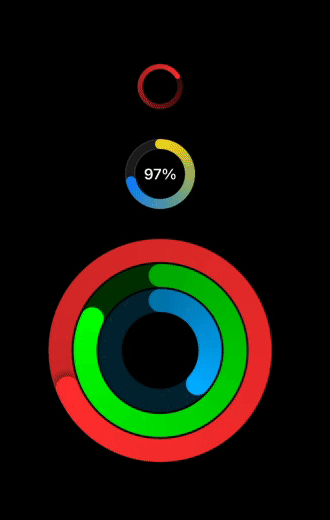

# WolfActivityRing

Apple Watch-style [activity ring](https://developer.apple.com/documentation/healthkit/hkactivityringview) for SwiftUI.

Originally inspired by Eric Callanan's [Create Activity Rings in SwiftUI](https://swdevnotes.com/swift/2021/create-activity-rings-in-swiftui/).

* Animatable.
* Supports values over 100%.
* Customizable. All attributes are bindings.
* May contain user-specified content, like a numerical percentage.

